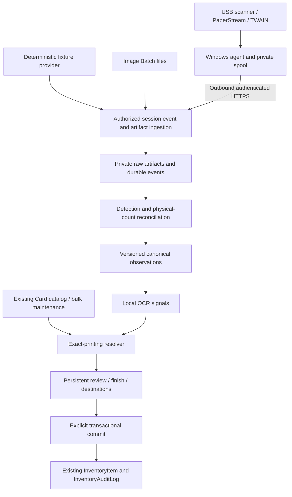

# Card acquisition architecture and repository findings

Status: proposed implementation architecture, **not implemented**. Baseline `bfb7be8`; see [roadmap](CARD_ACQUISITION_PLAN.md) for confirmed user decisions and priority. Names below are domain concepts, not instructions to generate every proposed model/file in one change.

## Repository evidence and reuse map

| Area | Inspected source | Reuse and required adaptation |
| --- | --- | --- |
| Runtime | `package.json`, `README.md`, `Dockerfile`, `docs/DEPLOYMENT.md` | Next 15/React 19/TypeScript, Prisma 6, PostgreSQL 16, Node 22 CI. Keep web as authenticated orchestration/review; CPU-heavy image work runs in a bounded worker. No existing OCR/native agent stack. |
| Inventory | `prisma/schema.prisma: InventoryItem`, `lib/inventory-manual.ts`, `lib/inventory-storage-move.ts`, `lib/deck-inventory.ts`, `app/imports/page.tsx` | Quantity stacks already preserve printing, owner/opener, finish, condition, language and location. Extract a narrow transaction-aware receipt helper; no second physical inventory model. |
| Storage | `lib/storage-layout.ts`, `lib/storage-sections.ts`, `lib/storage-summary.ts`, `components/StorageDestinationPicker.tsx`, `docs/STORAGE_LAYOUTS.md` | Reuse validated JSON layouts, exact section names, legacy Vault defaults and quantity aggregation. Existing capacities are advisory, direct-location counts exclude descendants. Adapt summary query to accept a transaction client. |
| Review | `app/imports/page.tsx`, `lib/import-review.ts`, `lib/import-progress.ts`, `lib/import-resolution-job.ts`, `docs/IMPORTS_WORKSPACE.md` | Reuse exact-printing search/presentation, location picker, review filters, explicit commit and attempt-history principles. CSV rows and import types do not model many observations per physical card; acquisition gets its own staging state. |
| Catalog | `lib/card-import.ts`, `lib/scryfall.ts`, `prisma/schema.prisma: Card`, `docs/SCRYFALL_INTEGRATION.md` | Extend existing printing-level Card store and canonical normalizers. Bulk ingestion is deferred, not implemented. Extract transaction/batch-friendly writes from the current global-client per-card upsert. |
| Audit | `lib/inventory-audit.ts`, `app/api/inventory/audit/route.ts` | Use existing audit actions/metadata and 500-record batched writes. Preserve acquisition lineage with commit receipts; do not introduce a parallel inventory audit system. |
| Uploads/files | CSV persistence in `app/imports/page.tsx`, backup upload/download routes, `lib/backup.ts` | Persistent bind mounts and protected file routing are precedents, not a reusable safe image-upload service. Need bounded streaming/image validation/private retrieval. |
| Authentication | `lib/auth.ts`, `lib/auth-sessions.ts`, `docs/AUTH_SESSIONS.md` | Server-validated user sessions, Player ownership bridge, explicit admin mode. Agent credentials are separately scoped, hashed and revocable; never reuse a browser cookie as a machine secret. |
| Jobs | `lib/notification-delivery.ts`, `scripts/notification-worker.ts`, `lib/import-resolution-job.ts`, Compose | Reuse database lease/claim/retry patterns in main app DB. Notification rows themselves remain notification-specific. Import resolution is launched from web with persisted status; it is not a general durable OCR worker. |
| Deployment | all Compose layers, `.github/workflows/docker-publish.yml` | Web, notification worker, pricing DB/worker and Redis already have roles. Capture state belongs in main DB, not pricing DB. Redis is not needed for v1 correctness. Windows TWAIN lives outside Linux Docker. |
| Recovery | `lib/backup.ts`, `lib/backup-drill.ts`, `docs/BACKUP_RESTORE_DRILL.md` | Existing appdata roots are allowlisted on restore. Extending mounts alone does not extend backup compatibility. Include capture data in the existing upload root initially and exercise isolated restore. |
| Tests | `tests/*.test.ts`, `tests/ui/imports-workspace.spec.ts`, `tests/ui/vault-map.spec.ts`, `playwright.config.ts`, `lib/verification.ts` | `tsx --test`, real local PostgreSQL fixtures via Docker, serial Playwright, build manifest guards. CI Core excludes browser/real DB fixtures and native Windows TWAIN; add explicit gates rather than assuming coverage. |
| Migrations | 61 existing directories; storage layout, auth session, notification queue, import resolution and Scryfall hardening migrations | Additive migrations in small stages, deploy-before-serving convention; no migration or backfill in this task. |

## Important gaps in the report's reuse assumptions

1. `confirmImport` inside `app/imports/page.tsx` reads a row, writes/increments inventory, then marks the row imported in separate Prisma calls. The variable `lockedItem` is a read, not a row lock; this function does not use `$transaction` or create `InventoryAuditLog` rows. Retry/concurrency safety and full audit cannot be inherited by simply calling this action. Catalogue separately and use a real shared transactional service before acquisition commit.
2. `addInventoryCardToLocation` accepts a transaction but clamps quantity to 999, falls back to NONFOIL/EN/default condition, sets opener to owner, and changes sourceType to MANUAL. Reuse validation/grouping concepts after refactoring explicit inputs; never feed UNKNOWN through this helper as-is.
3. `findOrImportCard` accepts a single local exact-name result and uses live fallback for set/collector misses. Local catalog uniqueness is not proof of globally unique printing, and this routine does not take OCR language or contradiction evidence. Capture needs a stricter local resolver composed from shared primitives, not a call-through to this importer policy.
4. Storage aggregation and the serializable move transaction are useful, but no shared capacity lock is held by all inventory writers. Reading occupancy inside one new capture transaction alone does not establish safe concurrent capacity decisions.

## Chosen system boundaries

Use the app's `lib` functions and typed DTOs, Prisma records, server actions for browser commands, and route handlers for uploads/agent transport. Avoid implementing a class hierarchy, service locator, generic event bus or microservice suite. Capture UI should be an acquisition task within Imports, with stable session deep links; do not add a peer global navigation entry for each provider. Final route naming belongs to P6.

## Persistent concepts and cardinality

| Concept | Identity and relationships | Index/constraint direction |
| --- | --- | --- |
| Capture session | createdByUserId (actor), ownerPlayerId (collection), explicit opener/default policy, destination/section snapshot, target policy, phase states, revision | owner + updatedAt; state + updatedAt; no per-provider schema or migration of existing inventory ownership |
| Provider run | session; provider key/version; device/config/capability snapshot; run generation; stop reason and event cursor | unique session + run identity; one active device lease per agent/device; allow sequential refill runs |
| Ingest event | run; sequence; payload hash; processing disposition | unique run + event sequence; identical replay returns stored result, same identity/different payload is conflict |
| Artifact | run/source artifact identity; private storage key/hash/MIME/size/dimensions; staged/ready/deleted lifecycle | unique run + source artifact ID; session + state; hash is NOT unique physical identity |
| Physical candidate | one believed physical card; stable ID/sequence; count certainty; target/overflow allocation; explicit finish/language/condition/opener; revision | unique run + native physical ID when supplied; session + sequence; session + review state |
| Observation | candidate + artifact; side, detection version/region key, crop polygon, transform, derivative keys | unique detection output identity; many observations to a candidate; one raw artifact can underlie many candidates |
| Recognition attempt | candidate/observation versions; raw and normalized OCR signals; candidate Card IDs; reasons/contradictions; engine/model/catalog versions | candidate + createdAt; immutable attempt records; review references a particular attempt |
| Review decision | candidate revision, selected attempt/Card, actor/time, attribute/destination decisions, ignored/reconciled observations | optimistic concurrency on candidate revision; edits invalidate stale ready/commit previews |
| Processing job | session/input/stage/version; status, attempt, lease token/expiry, heartbeat/error | unique input + stage + version; state + dueAt/lease expiry; no reuse of notification payload tables |
| Commit receipt/items | session + request key + payload digest; committed candidate membership and grouped inventory/audit result | unique session + idempotency key; candidate committed at most once; retain immutable printing/attribute snapshots |
| Agent and command (later) | paired user/install identity, hashed credentials/scopes/expiry; run command with ID/generation | revocation lookup; agent + command sequence; ownership is server assigned |

This is a schema design direction, not final Prisma syntax. Favor enums or validated status strings consistent with the chosen migration boundary, foreign keys for identity and JSON for versioned provider/evidence payloads. Do not put critical ownership, idempotency or commit membership only in opaque JSON.

Committed receipt items keep candidate IDs, chosen recognition/review versions, added quantity (one per candidate), group key, before/after group quantity, inventory row and audit IDs. Multiple candidates may point to one grouped increment: do not fabricate sequential before/after quantities for each card in that group. Historical identity/snapshots must survive permitted later inventory split/move/deletion and artifact retention cleanup; choose restrictive/nulling FKs with tombstones deliberately. Committed evidence is immutable.

## Phase states, counting and control

Keep acquisition, processing, review and commit states distinct. One overall session label is a projection, not a single enum that falsely implies processing cannot overlap ingestion:

- Acquisition: DRAFT → PREPARING → CAPTURING → STOPPING → COMPLETE; PAUSED/FAILED/CANCELLED where supported. Stop drains accepted in-flight evidence; cancel halts future work while preserving already received items.
- Processing: PENDING/RUNNING/BLOCKED/COMPLETE with retryable per-stage failures and attempt history.
- Review: pending/needs-review/ready derived from physical-count reconciliation and explicit required fields, using persisted decisions.
- Commit: NOT_COMMITTED/PARTIALLY_COMMITTED/COMMITTED. Readiness and receipts are durable; a COMMITTING display may be derived from a bounded operation, not an unrecoverable permanent flag.

Freeze a selected candidate revision set for a commit. A receipt seals those candidates; pending overflow/unresolved cards remain reviewable. Fully committed/closed sessions cannot resume acquisition. Further capture requires a new session. Failed/cancelled sessions keep evidence and have explicit recovery/discard choices; replay cannot reopen them.

Counters are separate: uploaded artifacts, native completed physical items, provisional detections, confirmed physical candidates, target-allocated physical count, resolved printings, reviewed/commit-eligible candidates, overflow, already committed and explicitly set-aside cards. A recognition failure changes resolution/review counts only. UNKNOWN finish likewise does not remove a physical card from the count. Target allocation is not the same as commit eligibility.

Native boundaries are evidence, not unlimited trust: a multifeed or missing side can leave count/pairing uncertain. Never infer physical count as images/2 or by even/odd transfer order. For multi-card images, stable region identities and reviewer split/merge corrections reconcile detection mistakes before commit. Count corrections are audited and cause target allocation/preview recomputation. Explicit merge of duplicate observations is allowed; hash similarity alone must never merge physical cards.

For image batches, use stable upload order and a persisted per-artifact spatial order initially; users can correct it. Recognition completion order must not choose which cards fall within the target. Processing can discover more candidates; uncommitted allocations remain provisional until reconciliation. Run refills have new run IDs without recounting earlier items. Image providers acquire only; detection determines card boundaries downstream.

### Provider capabilities

Advertise batch/streaming input, native boundaries vs detection-derived boundaries, duplex side metadata, multi-card artifacts, discover/configure device, pause/resume/stop/cancel semantics, resolution/color/vendor UI controls, multifeed/counters and enforcement strength. Request only supported controls; record requested AND negotiated values.

Use EXACT_BEFORE_NEXT_ITEM (proven fixture/possible future controlled hopper), BEST_EFFORT_STOP (TWAIN until proven otherwise), LOGICAL_ALLOCATION (image batch), or NONE. A stop call must be optional/capability-gated; an upload provider should not fake hardware control. No pre-created camera/hopper/mobile enums or placeholder implementations are needed; allow validated provider registration keys later.

A session owns target and policy; a prepared run receives a versioned remaining-target budget and enforcement instructions. The agent counts/stops locally without a per-card round-trip, but cannot change the business target. A new target budget requires explicit server/run reconciliation. Fixture exact mode leaves 37 of 300 inputs untouched at 263; best-effort/image mode may receive all 300 and retain 37 overflow. These are separate assertions, not an ambiguous combined count.

### Event and processing recovery

At-least-once transport, idempotent effects. Persist run/event identity, payload hash and event body before acknowledging. Out-of-order events are retained until dependencies/gaps resolve; use a contiguous acknowledged cursor, not the largest received sequence. Gaps and incomplete sides block count certainty rather than disappearing. Artifact completion verifies durable bytes, digest and DB association before ready/ACK; retries reconcile temp files and metadata after crashes.

Job claims use expiring leases and fenced completion tokens following the notification worker pattern. Reclaimed work cannot have a stale worker overwrite current outputs or manual review. Immutable output keys include input/stage/version. Bound concurrency, timeouts, retries and per-session queue size; dead work becomes visible review/retry state. No unawaited web process is the sole owner of acquisition work.

## Capacity and inventory write design

Reuse location layouts and sums of positive inventory quantities. Respect exact selected section and overall bound (the tighter known bound); do not confuse the sum of other sections' room with room in the selected section. Null means unknown, not zero. Full means zero remaining and prevents automatic fill-to-capacity start; manual acquisition/target is still possible with later explicit capacity acknowledgement. Hierarchy counts are direct, not recursive. Deck/system-managed/inactive/foreign locations remain invalid destinations.

Session target snapshots do not reserve physical space. Unrecognized candidates consume target slots, but do not create fictitious inventory occupancy before commit. Display committed occupancy and pending session counts separately. Partial commits subtract only newly selected quantities; never double-count already committed candidates.

At commit, freshly authorize actor/owner; validate candidate revision, printing/finish/language/condition/opener, locations, layouts, target allocation and unchanged proposed group payload. Serialize same-session commits and all participating destination occupancy changes. Proposed strategy: deterministic ordered transaction-level locks on destination location IDs, with every relevant app writer taking the same locks before layout/occupancy reads or writes. Inventory/action/import/trade/deck/location move and creation paths identified in source must be covered. A single capture-side advisory lock or serializable transaction cannot promise isolation from existing uncoordinated writers. Select the concrete coordinated locking/version strategy and demonstrate it in P7 before enabling commit.

Default shortfall behavior: return a refreshed preview and perform no mutation. User may reassign candidates, explicitly select a smaller commit (others remain pending), or explicitly confirm over-capacity. Override is bound to session/candidate revisions and current per-destination layout/occupancy preview, quantity and actor; a changed preview requires reconfirmation. Record measured before/after occupancy, shortfall and confirmation in the receipt/audit. Preserve advisory behavior of ordinary inventory writes; coordinating their writes does not make them capacity-blocking. No reservation system or global hard-capacity policy in v1.

Commit one explicitly selected bounded set atomically: claim idempotency key and payload hash; recheck invariants under locks; group compatible quantities; write inventory + audit + receipt/items + candidate status together. Retry of the same key/payload returns the receipt; changed payload under same key is conflict. Separate keys cannot commit the same candidate twice. No Scryfall/network/image processing inside the transaction. Failure rolls back all inventory effects; a separately recorded diagnostic attempt must not suggest success.

Reuse existing receipt/stack attributes, including original opener, pull/round/source/notes semantics where present. Do not merge into unrelated existing lots merely because printing, finish and location match. Report #213 already established provenance-preserving movements. Add an explicit acquisition source or documented source mapping through the common helper; do not silently label capture MANUAL or CSV. Quantity arithmetic must be exact, without the manual helper's 999 clamp. Immutable audit provenance and receipts remain authoritative after subsequent moves. Capture does not invent per-copy stock rows or automatically undo spent/traded stock.

## Catalog, canonical images and recognition

Extend Card; no separate recognition catalog. Make explicit admin maintenance populate indexed printing records using shared normalization and existing Scryfall storage path. It must be streaming/bounded, resumable, lease-protected and observable. Record dataset type/coverage/version and completion state; partial imports cannot claim completeness or cause auto-accept from accidental uniqueness. Preserve existing foreign references, first-cache history and unrelated pricing fields. Do not truncate Card or replace referenced IDs. Stage metadata/index changes and report identity collisions instead of skipping them invisibly.

Proposed first dataset is default_cards for the confirmed mostly-English use case; it does not cover all languages. all_cards is the later completeness option when needed. A non-English observation outside verified coverage remains reviewable/missing-catalog; it must never silently resolve to an English printing. Use nonunique set/collector/lang and name/printed-name/face-name lookup indexes as measured; collector numbers remain strings including suffixes. Revisit the existing unique mtgjsonUuid compatibility before broadening the dataset. Ordinary recognition is local; optional explicit manual catalog refresh may use the centralized Scryfall client with coordinated outbound request budget.

Normalize raw decode/EXIF orientation → card detection/region reconciliation → perspective correction → side/orientation → canonical image/quality metrics → title/collector metadata OCR. Keep raw original and transformation provenance. Derived images remove unnecessary metadata. Orientation does not assume every Magic layout has a conventional title/footer. Detecting a quadrilateral alone does not prove a physical card; exclude background/shadow rectangles and expose uncertainty/manual region repair. Front/back recognition must understand DFC faces versus generic card backs; backs are not extra copies.

Resolver receives evidence, not a provider type. Candidate search: set+collector+language, then set+collector, then exact name+set, then name/fuzzy suggestions. Missing coverage, contradictory readable name/language, multiple variants, unreadable metadata or weak observations prevent automatic acceptance. Printed-language and face aliases matter. A user-confirmed batch EN default is explicit evidence, not an inference from mostly-English usage. Finish stays UNKNOWN in staging until explicitly selected; validate finish against printing availability and set the legacy foil boolean consistently. Unknown condition likewise requires an explicit batch default or per-card decision; do not imply automated grading.

Keep raw/normalized text, regions, quality, engine/model versions, catalog snapshot, ranked candidates and reason codes per immutable attempt. Manual decisions take precedence over later background results. Numeric scores, if retained, are engine-specific evidence, not calibrated probabilities. Proposed automatic acceptance requires a supported unique printing key, independently consistent title/face evidence and sufficient catalog coverage; until corpus calibration passes, proposals require user review. Name-only is always suggestion-only, even with one locally cached row. Contradictions always require review.

## Artifact storage, privacy and backup

Start under the existing persistent upload root: a private `captures/<session-id>/` namespace for raw/canonical/thumbnails, generated keys only. This reuses existing backup root mapping. No new CAPTURE_DATA_PATH by default; add a dedicated root only if measured disk/retention needs justify extending every Compose layer, entrypoint, backup creation/restore allowlist and recovery drill together.

Filesystem bytes stay out of PostgreSQL; DB stores linkage/size/hash/state. Validate allowed format by bytes and bounded decode, not MIME/extension alone. Proposed v1 allowlist: JPEG/PNG/WebP; explicit unsupported response for HEIC unless evaluation adds a local decoder. Limit compressed size, decoded pixels, frames, per-session/owner bytes and worker memory. Reject path traversal/symlinks, archives and remote URL fetching. Streaming API limits must align with proxy/body limits rather than copy the whole-backup buffer route.

Authenticate every raw/crop/thumbnail retrieval against current owner/admin scope; no static public upload URLs. Hashes verify integrity and retry payload, not physical copy identity or cross-owner sharing. Crash cleanup uses state/age references; do not delete leased/in-flight files. Retention is separate for abandoned, failed, unresolved, committed raw and reproducible derivatives. Initial proposal: unresolved/overflow never automatically purged without an explicit policy and notice; committed raw retention and quotas must be chosen before real-data release. Tombstone pruned artifacts while keeping recognition/commit provenance. Cleanup resumes safely and respects shared raw-image references.

Backups already include the uploads root; measure resulting archive growth. Coordinate a capture-worker pause/drain or consistent artifact watermark during backup/restore and verify hash/link availability after recovery. Existing DB and filesystem backup/restore are not one atomic transaction. Restore fences old leases/agent generations and reconciles spools: a pre-restore ACK does not justify replaying a physical addition as new stock. Keep an independently protected spool reconciliation window; mismatched server epoch requires review, not automatic recapture/commit.

## Windows agent and TWAIN

Recommendation for confirmed topology: user-session Windows process, outbound authenticated HTTPS polling/commands/events and bounded streaming uploads. No browser-to-localhost API, inbound port, Unraid USB passthrough or privileged command execution. LAN TLS/trust setup is a deployment prerequisite; do not silently downgrade credentials/images to cleartext or disable certificate validation.

Pair with a one-time expiring code approved by the signed-in owner; agent receives revocable scoped credentials stored with Windows user protection, hash only on server. Restrict to its authorized sessions, ingest/status/config and supported device commands; no inventory commit, catalog administration, shell or admin-mode privilege. Recheck disabled accounts/revocation. Browser review/commit uses normal authenticated user authorization. Validate schema/version/payload limits and bound replay storage.

Persist local command IDs, run identity, generation, spool bytes/hashes and acknowledgement cursor. Replayed START returns the existing run; it must not feed again. Drain local buffered output on STOP; CANCEL retains acquired evidence. On server disconnect, bounded local target and disk watermarks govern continuation/stop. Pairing ambiguity after crash must require physical reconciliation. Agent/device lease prevents two sessions driving one scanner. UI must distinguish disconnected, stopping, feeder exhausted and stalled upload. Diagnostics work before hardware integration.

Isolate source enumeration, negotiated capabilities, native message loop/threading, transfer lifecycle and error codes behind a TWAIN backend. Evaluate .NET plus a maintained wrapper versus direct native interop; choose architecture from compatible source/DSM/library, not x86 by decree. Use a user-session process for native driver UI requirements; do not assume Windows service Session 0 works. The official virtual source proves transfers, not card feeding or physical sheet identity. If reliable page-side/document boundaries are unavailable, advertise counting uncertainty; never manufacture certainty from transfer order. Pin tested binaries/versions and separately review packaging/licenses/update verification in P9/P10.

## Migration and rollout ordering

1. Pure contracts/tests first; additive session/run/event/candidate/observation persistence with ownership constraints next. No existing inventory/User-to-Player migration.
2. Artifact/job/recognition/review records when their phases need them; nullable compatibility fields first, then validate/backfill new capture-only data before stronger constraints. Existing CSV records stay readable.
3. Catalog indexes/refresh metadata as a measured migration; use explain/performance checks, migration lock assessment and production-sized rehearsal before large catalog ingestion.
4. Shared transaction helper and destination coordination introduced with existing-flow regressions before capture commit enablement; receipt uniqueness/FKs precede the endpoint.
5. Agent credentials/commands added only in P9. Keep UI/provider enablement off until dependencies/migrations/worker mounts exist. Rollback disables capture and drains work; do not drop evidence or roll back to duplicate-prone commits.

## Deviations from the supplied research

| Report suggestion | Adaptation and reason |
| --- | --- |
| Broad proposed files/classes/schemas | Domain records and function boundaries above; exact code layout chosen per batch using existing conventions. |
| Treat import commit as reusable atomic/audited infrastructure | It is not currently atomic/audited on the reviewed path. Track the gap; share a strengthened transaction-aware helper. |
| Reuse resolver outcomes directly | Reuse normalizers/Card persistence; require capture-specific contradiction/language/coverage gates. |
| Add dedicated capture mount immediately | Begin within existing uploads/backup root, with private namespace and measured limits. |
| One linear session enum | Separate acquisition, processing, review and commit phases; support retained overflow and partial explicit commits. |
| Block every capacity excess | User explicitly allows an audited fresh override; keep existing advisory storage policy. |
| Copy a proposed provider interface with mandatory scanner controls | Capability-gate optional controls; image acquisition need not pretend it can stop a feeder. |
| x86 first | Decide from verified DSM/source/backend compatibility; x64 is not ruled out and neither is selected now. |
| Confidence constants / 99.5% on 200–500 cards | Calibrate and report denominators/statistical limits; zero observed wrong selections is a release test requirement, not proof of perfect population accuracy. |
| Hardware near the first release and hardening last | Complete and harden image-only release first; security/recovery start in the foundation. |
| 144–214 hours estimate | Do not adopt unvalidated estimates. Estimate individual batches after engine/corpus/native spikes. |
| Exact stop inferred from scanner transfer count | Best effort plus negotiated boundary evidence; physical stop must be characterized on hardware. |

See [milestones](CARD_ACQUISITION_MILESTONES.md) for unresolved decisions and [primary sources](reference/card-acquisition/README.md) for what was independently verified.
