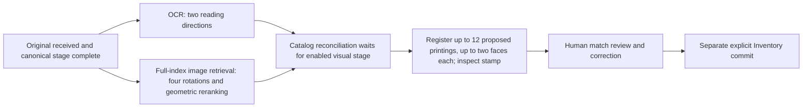
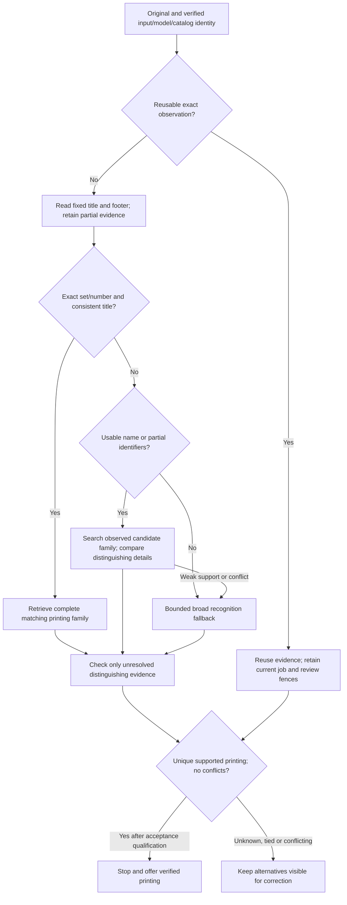

# Recognition pipeline audit — working evidence

Status: active, incomplete. Source baseline: merged main
`e247916f7022f360cedbc05398cba607cbcfb24d`. This is an audit and isolated benchmark;
no runtime policy is promoted, no reviews/Inventory are changed, and no physical
scanner or production operation is authorized. Existing reading strips stay fixed:
canonical title rows 0–250, footer rows 1270–1397.

## Current execution map

- OCR decodes and localizes the original independently, reads fixed title/footer
  strips in two directions, and can request separate whole-photo OCR when its
  initial proposals need it. Quarter-turn geometry retries precede that fallback.
- Visual retrieval starts after canonical completion independently of OCR quality.
  It localizes again, embeds four rotations, searches the whole published index,
  and geometrically matches the first 40 reference faces. It returns two bounded
  candidate orders. A strong OCR identifier does not currently skip this work.
- With visual enabled, catalog reconciliation requires its latest complete result.
  It tries exact/whole-photo names, missing visual IDs and image names, then printed
  identifier queries. Deduplication and shared lookup caches already exist: a lookup
  is not automatically a new network request. Reconciliation reloads the local
  catalog projection when needed and combines evidence into at most 12 proposals.
- Combining already preserves nonconflicting set/collector matches ahead of weak
  images. Therefore a claim that generic visual rank always overrides identifiers
  would be wrong. Partial title/collector alternatives use image agreement; bounded
  candidate truncation, contradictory-title demotion and family completeness still
  need measured failure analysis.
- Printing verification decodes the original again, computes query registration
  features, and registers against each proposed reference face. It is stamp-focused,
  not a general set-symbol/footer/frame discriminator. Unreadable stamp observations
  retain uncertainty and conflicts. This stage runs for catalog completions even
  where an expensive general check may be unnecessary.
- Hybrid results intentionally remain review-only. Enabling printing disables the
  automatic-confirm worker. Baseline automatic identification coverage must be
  distinguished from correct first suggestion and default bulk-review selection.
- Catalog refresh eligibility can revisit completed work by age; printing lineage
  depends on the new catalog job. Versioned/native input reuse needs evaluation
  before any deduplication fix is proposed.

Sources: `lib/acquisition-{recognition-worker,visual-worker,catalog-reconciliation,
printing-worker,visual,printing,auto-confirm}.ts` and
`tools/acquisition-runtime/{recognize,visual,printing,printing_worker}.py`.

## Read-only historical diagnostics

Private repeatable-read snapshot: 883 retained originals, 365 distinct byte
hashes, 76 saved reviews (20 automatic-origin, 56 without an automatic source).
Neither a saved choice nor a apparently successful suggestion is independent
truth. Existing historical corpora include 23 phone photos, 17 scanner images and
124 batch scans; these have already participated in development and cannot be
relabelled as unseen validation simply by splitting them now.

At a separate read-only history capture, 8,105 completed printing jobs map to
1,717 distinct original-digest / printing-model / policy / candidate-ID-set requests.
There are 6,388 repeated combinations. These include migrations, repeated uploads,
revisions and test history; this is an opportunity count, not a benchmark claim
that every repeat was unnecessary or safely shareable across owners.

Latest saved native timing diagnostics: OCR median 4.109 s (p95 5.910 s), global
visual retrieval median 8.118 s (p95 11.728 s), printing median 8.156 s (p95 11.601 s).
The populations differ and concurrent load is uncontrolled. Do not add these medians
or call them end-to-end latency. Catalog output inherits OCR timing; that inherited
field is not catalog-stage timing. These history rows are diagnostic only; the paired trials below measure inference separately.

A reserved 41-image validation pool has been independently read from original
card faces and enlarged complete footers: 34 mostly WAR scans plus seven additional
printing groups, including two visible stamped reprints and unusual treatments.
No normalized set/collector group overlaps checked-in development manifests.
Physical-copy independence remains unknown; this is held out from audit policy
selection, not a claim about all historical runtime/model development. Natural
poor-photo held-out coverage is missing. The 40-image development pool reuses all
23 original phone and 17 scanner examples and is explicitly development-used.

A seeded uniform sample of 12 distinct retained digests with completed, nonempty
catalog suggestions was frozen before manual inspection (seed 20260930, eligible
population 355). Eight show identifiable fronts; four show backs/sleeve artwork
or a synthetic fixture. Retain all 12 in the random audit; separate the synthetic
fixture and unobservable printing targets from strict-front-printing accuracy.
These are apparent suggestions, not independently established successes.

## Benchmark protocol — fixed before alternatives

1. Export consistent read-only originals, review and Inventory fingerprints,
   source/model/index/catalog/reading-zone hashes and stage history. Keep all photos,
   user IDs, saved text observations and full snapshots private under `.local-data`.
2. Visually verify printing labels before examining alternative output. Include
   ordinary, stamped, shared-art, unusual-layout, poor-read and seeded random
   apparently-successful strata. Keep stamp unreadability explicit. Represent
   physically identical product distributions as acceptable printing-equivalence
   sets, not a booster-origin target. Ambiguous truth is excluded from strict-ID
   accuracy and reported as unresolved/equivalence-scored, never guessed.
3. Freeze development and separate validation manifests before tuning. Group
   recaptures/rotations of the same physical copy together; where identity is unknown,
   disclose it and conservatively group known printing/visual duplicates. No
   ground-truth-selected reference candidates in an inference path.
4. Compare current runtime, a reference/result-reuse-only version, identifier-first
   escalation, and partial-evidence-constrained retrieval on identical originals,
   fixed catalog/index, fixed reading zones and equal resource limits. Benchmark
   cold start separately; alternate/repeat warm runs to reduce order/load bias.
5. Record per-card exact first printing and equivalence accuracy; accepted-and-wrong
   rate; automatic coverage and abstention; median/p95/max end-to-end and native
   stage times; OCR calls, embeddings, full-index searches, registrations, provider
   requests versus cache hits; wrong proposals requiring correction and unresolved
   manual decisions. No simulated skipped time is a measured runtime result.
6. Lock the policy after development, then run validation once. Report strata,
   confidence intervals, corpus/catalog coverage and selection/physical-independence
   limits. Measure the two-path 95% estimate; do not assume it or count an oracle
   selecting the best method after seeing expected IDs.
7. Recheck preservation fingerprints and source-zone hashes. Deliver the evidence
   map, decision tree justified by paired results, representative failures and
   prioritized implementation batches. Any resulting application change needs its
   own current-head checks/local review and individual merge approval.

## Isolated benchmark qualification

The audit uses the same runtime sources as the reviewed main application, pinned
native image IDs, frozen 118,484-card local projection and complete published
English paper index (112,536 reference faces; 899 explicitly unavailable). It does
not supply expected IDs to retrieval. Baseline runs OCR and broad visual retrieval
in parallel, combines actual observations, then sends its bounded proposals to
printing verification. Provider cache misses, queue waits and intake/preparation
are excluded; do not present these timings as upload-to-review latency.

The alternatives use exact observed identifier/title agreement to restrict
printing verification and skip broad retrieval, then optionally name/partial-ID
candidate scopes before global fallback. Contradictions prevent scope selection;
missing/weak scoped geometric support escalates. Native models, reading zones,
registration and stamp policy remain unchanged. Automatic decision eligibility
is an offline rule only; no application confirmation or Inventory write occurs.

An initial diagnostic trial did not retain completed whole-photo progress when
the parent deadline fired. It was stopped and is disqualified from the final
accuracy comparison. The corrected adapter preserves production progress semantics
and uses the application partial-text reader. A separate three-input qualification
retained partial readings in difficult phone/scanner cases and passed. Interrupted
inference counts are marked as lower bounds; completed printing/search counts
remain separately measured.

The qualified development trial completed all 120 paired observations. The four
routing/transport source hashes and truth manifests were locked before validation.
Validation, seeded random cases and repeated timing use that same policy without
further tuning. Warm native/reference caches are shared; method order rotates per
card. Cold starts and restarts are tagged. Application background workers remain
active, so timing is indicative on this laptop and includes cache-order asymmetry.
Operation counts are stronger evidence of saved work than a portable speedup ratio.

## Development comparison (40 previously used images)

| Method | Exact first printing | Wrong first suggestions | Median / p95 inference | Global searches | Geometric comparisons | Printing registrations |
|---|---:|---:|---:|---:|---:|---:|
| Current parallel OCR + global image | 34/40 | 6 | 19.11 / 38.18 s | 40 | 1,600 | 506 |
| Exact identifiers first, else global | 34/40 | 6 | 7.67 / 42.40 s | 17 | 680 | 244 |
| Exact identifiers, then observed partial scope, else global | 38/40 | 2 | 7.01 / 44.62 s | 4 | 178 | 110 |

All methods offered the verified printing somewhere in their bounded proposals
on all 40 development images. Wrong-first counts are correction proxies; no human
review action was performed. The application remains review-only on every image.
The experimental conservative stop gate would accept six exact-identifier images,
all six correct in this sample (15% coverage). Six successes are too few to establish
population acceptance precision. The alternatives expose 18 strong suggestions;
none are wrong here, but a strong suggestion is not an automatic confirmation.

The first two routes handle 36/40 images (90%), and have the right first printing
on 35/40 (87.5% of the entire development sample). These are different quantities
from the 38/40 overall first-suggestion accuracy and six eligible automatic stops.
They do not demonstrate 95% routing or automatic coverage. Descriptive image-level
Wilson intervals for exact first printing are 70.9–92.9% current versus 83.5–98.6%
partial-scoped; development reuse and correlated printings prevent population claims.

The serial routes improve median work but worsen the difficult-read tail. Whole-
photo OCR may consume its budget before broad retrieval starts. An implementation
should overlap a bounded broad fallback when OCR has not produced a usable scope,
and cancel/ignore superseded retrieval if stronger evidence arrives. That overlap
is a proposed implementation experiment, not a speedup measured by this trial.

An isolated exact-request reuse prototype measured 800 warm lookup/serialization
hits over 40 native printing observations. Every result serialized identically,
including unknown stamps and wrong suggestions; expensive operations per hit were
zero. Median lookup was 0.045 ms, p95 0.075 ms, versus separately measured native
printing median 8.84 s / p95 12.50 s. This measures the cache hit itself, not repeated
full-pipeline latency. Warmup, database retrieval, persistence, TTL, cross-process
invalidation and current job/review publication fences remain implementation work.

## Recommended direction pending locked validation

The tested acceleration is exact/partial candidate selection. The unchanged native
printing verifier checks registration and stamps; it does not yet compare set
symbol, footer and frame differences generally. Those detail checks in the diagram
are an implementation requirement, not claimed as an evaluated classifier. A stamp
check is needed when the catalog family leaves a stamp ambiguity; unknown evidence
must not be promoted to absence. The experimental stop gate is deliberately stricter
than family uniqueness and may underestimate future automation; it has not justified
relaxing acceptance. Preserve original/List equivalents and avoid booster-origin
claims for physically identical products.

## Validation and repetition still running

The 41-image reserved trial, 12-image seeded audit and nine timing-repeat observations
are not complete yet. Do not read the development table as an independent validation
result. Final implementation priorities will be reconciled with those locked trials.

Representative diagnostic finding: Timberland Ancient's exact MOM210 footer
retrieves both its original and PLSTMOM-210. The stamp detector reports unknown
on this photo, so both baseline and the identifier-only trial place the original
first and require correction; the conservative offline stop rule abstains.
Unrelated visual searches do not repair this missing distinguishing evidence.

Printing-marker semantics are grounded in the manufacturer's
[Mystery Booster release notes](https://magic.wizards.com/en/news/feature/mystery-booster-release-notes-2019-11-11)
and [Mystery Booster2 treatment guide](https://magic.wizards.com/en/news/feature/whats-inside-mystery-booster-2).
The marker preserves earlier printed identifiers on relevant reprints. Special
frames/white borders/acorn cards have separate treatment rules. These sources do
not justify inferring a booster product from identical visible artwork/markers.

## Implementation batches to qualify after the audit

1. **Reuse unchanged native printing observations.** Key by server-established
   owner, original digest, full native/reference/policy versions and exact ordered
   candidate envelope. Keep input validation and before/after current catalog job,
   candidate revision, review, physical generation and commit checks on cache hits.
   Bound storage and retain unknown/conflicting evidence. Record a cache-hit duration
   separately from the original native timing. Start with printing; existing reference
   feature LRUs already exist and are not a substitute for result reuse. Acceptance:
   same serialized observations/proposals, no inference for an exact hit, misses
   across every version/input/owner boundary, and stale/reviewed jobs cannot publish.
2. **Route exact identifiers and observed candidate scopes before broad search.**
   Resolve the full title/set/collector/language family, including retained-source
   List counterparts. Preserve partial progress and contradiction checks; verify
   geometric support and escalate on weak or unsupported scopes. Keep global search
   available for poor localization and unknown layouts. Add bounded speculative
   overlap for slow OCR to protect the tail; qualify that separately. Acceptance:
   paired replay does not lose offered correct printings, fixes the shared-art title
   mismatch, reduces full searches/registrations, and does not worsen the slow tail
   under repeated representative load. Actual app queue/provider latency must also
   be measured, because this audit's frozen cache excludes them.
3. **Verify only unresolved printing differences, with clear uncertainty.**
   Tighten the printing candidate family after supported scoped evidence rather
   than retaining unrelated weak candidates. Compare aligned footer/set symbol/frame
   when shared art leaves multiple printings; verify stamps only for unresolved stamp
   families. Unknown stamp evidence stays unknown, and physically identical product
   distributions remain equivalent. Preserve originals and the current reading zones.
   Acceptance requires independent positives and difficult negatives for each detail
   rule, not a threshold adjustment to fix Timberland Ancient alone. Keep alternative
   choices easy to review while evidence remains tied or unreadable.
4. **Qualify acceptance and coverage before enabling automatic decisions.**
   Use new printing-group and physical-copy held-out strata: naturally poor phone
   photos, clipped/blurred marker regions, shared-art treatments, rare layouts,
   supported languages and unavailable references. Measure wrong automatic decisions,
   abstention, corrections and confidence intervals separately from retrieval rank.
   Do not enable automation from six development successes or use the development
   95% top-suggestion figure as a 95% automatic-coverage claim.

Each implementation batch needs its own local Docker acceptance, current-head
checks and individual PR merge approval. The audit tools do not deploy these changes.
